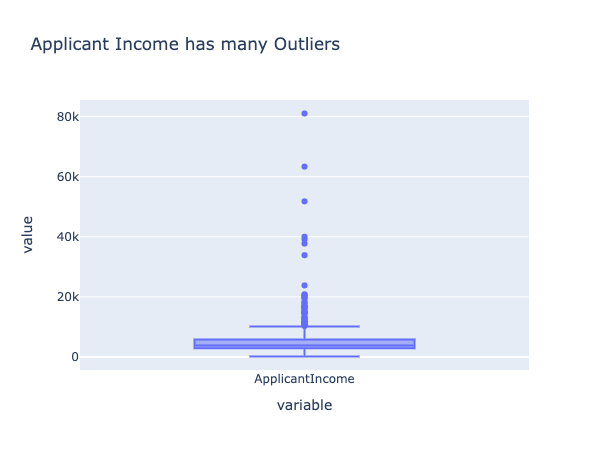

# Mini-project IV

### [Assignment](assignment.md)

## Project/Goals
1. Build a pipeline that accurately predicts loan approval status
2. Ship an API that accurately predicts loan approval status

## Hypothesis
1. Gender has no bearing on approval rate.
2. Marital status and education will be an indicator of income
3. If loan amount exceeds income over the loan term, should be low approval
5. Credit history will be correlated with approval

## EDA 
1. Genders are skewed heavily male
2. Substantial outliers for income and loanamount, apply log transformation

Applicant Income           |  Loan Amount
:-------------------------:|:-------------------------:
  |  

3. Education and marital status is correlated with income
Education       |  Marital Status
:-------------------------:|:-------------------------:
  |  

4. Credit History is strongly correlated with approval

## Process

1. EDA with plots, checking distributions, unique value counts, and more.
2. Merge incomes into total income, and apply log transformation to income and LoanAmount.
3. Onehot encode categorical variables and scale numerical variables.
4. Apply PCA and Select K best to find the best features.
5. Build entirely within a pipeline
6. Grid search to find the best features, hyperparameters and classifier for the problem.
7. Export the model with pickle, use Flask to make an app and deploy on AWS.

## Results/Demo

Best test set accuracy: 0.86
Achieved with hyperparameters: 
* 'classifier': SVC(C=0.5, kernel=linear)
* PCA Components: 2
* SelectKBest: 1
* Scaling: Standard Scaler

## Challanges 
-Using a full pipeline was challenging but helped me learn best practices for the future.
-Learning to properly apply and sequence transformers for the use-case took quite a bit of time.
-Troubleshooting the API is very time-consuming. Difficult to troubleshoot each step.
-Using the incorrect environment caused errors that took hours to solve

## Future Goals
-Clean formatting for the API, maybe add more functionality / an HTML gui
- 